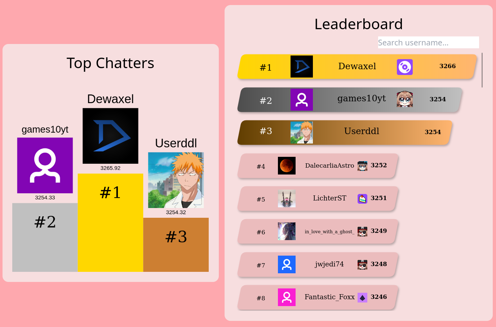

# Neuro-sama Community Elo Leaderboards

[Site](https://vanorsigma.github.io/neuro-chat-elo)

Ever wanted to flex how much of a chatter you are? Or perhaps you've
always wanted to quantify how much you love Neuro-sama? Maybe you
loved the elo stream and want to see some kind of competitive aspect
to your chatting shenanigans?

Introducing the community-led elo leaderboards:

**Status**: Public Alpha

Please see the
[roadmap](https://github.com/orgs/vanorsigma/projects/1) to find out
what is being worked on. Broadly, the project has the following goals:

- Be a fun stream companion that is impartial and general to all
  events
- Assist the [Neurocord](https://discord.com/invite/neurosama)
  community in garnering interest in events, such as the Pixel Canvas.

The project has the following major features incoming:
- Live Leaderboard calculations, in preparation for the next subathon
- Opting out integration for those who don't want to participate
- Special event leaderboards

For any suggestions / questions, please reach out in [this Discord
thread](https://discord.com/channels/574720535888396288/1246947536615243806),
or alternatively open an issue.

## Contributors

- jameshi16 (vanorsigma)
- gaijutsu
- owobred

## License

Please see [LICENSE](./LICENSE).
